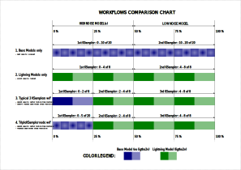

# ComfyUI-TripleKSampler

Triple-stage sampling nodes for Wan2.2 split models with Lightning LoRA integration.

## Features

- **Triple-Stage Workflow** - Base denoising → Lightning high → Lightning low
- **Two Node Variants** - Simple (smart defaults) and Advanced (full control)
- **Intelligent Auto-Calculation** - Optimal parameter computation
- **Model-Safe Cloning** - No mutation of original models
- **Sigma Shift Integration** - Built-in ModelSamplingSD3 support

## Quick Start

1. **Install**
   ```bash
   cd ComfyUI/custom_nodes/
   git clone https://github.com/VraethrDalkr/ComfyUI-TripleKSampler.git
   cd ComfyUI-TripleKSampler && pip install -r requirements.txt
   ```

2. **Use** - Find nodes under `TripleKSampler/sampling` category after ComfyUI restart

3. **Configure** - Connect your Wan2.2 models and set basic parameters

## Why Use TripleKSampler?

The TripleKSampler node streamlines complex multi-model workflows while respecting base model step resolution. The diagram below compares four different approaches:



**Workflow Comparison:**
1. **Base Models Only** - Maximum quality, slowest generation (full base model processing)
2. **Lightning Models Only** - Minimum quality, fastest generation (full lightning processing)
3. **Typical 3 KSamplers** - Manual setup with decent quality and improved motion, but doesn't respect base model step resolution
4. **TripleKSampler Node** - Automated approach with decent quality, improved motion, and proper base model step resolution

The example shown uses `lightning_start=2`, `lightning_steps=8` with the default Base Quality Threshold and the 50% switch strategy. This demonstrates how TripleKSampler automates the complex model switching that would otherwise require manual KSampler coordination.

## Node Types

| Node | Category | Best For | Key Features |
|------|----------|----------|--------------|
| **TripleKSampler (Simple)** | Sampling | Most users | Smart defaults, auto-calculation, streamlined interface |
| **TripleKSampler (Advanced)** | Sampling | Power users | Full control, 5 switching strategies, dry-run testing |
| **Switch Strategy (Simple)** | Utilities | Simple node users | External strategy for TripleKSampler (Simple), 3 strategies |
| **Switch Strategy (Advanced)** | Utilities | Advanced node users | External strategy for TripleKSampler (Advanced), 5 strategies |

## Essential Parameters

- **sigma_shift** - Sigma shift value (default: 5.0)
- **base_cfg** - CFG for base denoising (default: 3.5)
- **lightning_start** - Starting step in lightning schedule (default: 1)
- **lightning_steps** - Total lightning steps (default: 8)

## Documentation

- **[📖 Complete Documentation](https://github.com/VraethrDalkr/ComfyUI-TripleKSampler/wiki)** - Comprehensive guides and reference
- **[⚙️ Installation Guide](https://github.com/VraethrDalkr/ComfyUI-TripleKSampler/wiki/Installation-Guide)** - Detailed setup instructions
- **[📋 Parameter Reference](https://github.com/VraethrDalkr/ComfyUI-TripleKSampler/wiki/Parameter-Reference)** - Full parameter documentation
- **[🔧 Configuration Guide](https://github.com/VraethrDalkr/ComfyUI-TripleKSampler/wiki/Configuration-Guide)** - TOML configuration setup
- **[🎯 Model Switching Strategies](https://github.com/VraethrDalkr/ComfyUI-TripleKSampler/wiki/Model-Switching-Strategies)** - Strategy explanations
- **[🚀 Advanced Features](https://github.com/VraethrDalkr/ComfyUI-TripleKSampler/wiki/Advanced-Features)** - Edge cases and special modes
- **[🛠️ Troubleshooting](https://github.com/VraethrDalkr/ComfyUI-TripleKSampler/wiki/Troubleshooting)** - Common issues and solutions

## Example Workflows

Example workflows are included in the `example_workflows/` directory.

**Text-to-Video (T2V)**:
- `t2v_simple.json` - Simple node with smart defaults
- `t2v_advanced.json` - Advanced node with full parameter control
- `t2v_simple_custom_lora.json` - Demonstrates layering custom LoRAs with Lightning LoRAs

**Image-to-Video (I2V)**:
- `i2v_simple.json` - Simple node with smart defaults
- `i2v_advanced.json` - Advanced node with full parameter control

**Hybrid Workflow**: `hybrid_workflow.json` showcases the Switch Strategy utility nodes for external strategy control. Demonstrates using different switching strategies for T2V and I2V branches in a single workflow.
- **Requires**: [rgthree-comfy](https://github.com/rgthree/rgthree-comfy) custom nodes

**Math Node Comparison**: `tripleksampler_vs_math.json` demonstrates how to replicate TripleKSampler (Simple) behavior using manual math node calculations. This workflow provides a side-by-side comparison to help understand the internal calculations and validate the node's behavior.
- **Requires**: [ComfyUI-Easy-Use](https://github.com/yolain/ComfyUI-Easy-Use) and [ComfyUI-Custom-Scripts](https://github.com/pythongosssss/ComfyUI-Custom-Scripts)

## Support

- **Issues** - [GitHub Issues](https://github.com/VraethrDalkr/ComfyUI-TripleKSampler/issues)
- **Documentation** - [Project Wiki](https://github.com/VraethrDalkr/ComfyUI-TripleKSampler/wiki)
- **Updates** - [Changelog](CHANGELOG.md)

## License

Apache 2.0 License - see [LICENSE](LICENSE) file for details.

---

**Author**: [VraethrDalkr](https://github.com/VraethrDalkr)